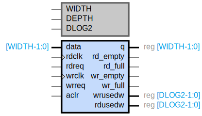

### **Asynchronous FIFO**

### Symbol

#### **General Description**
The Asynchronous FIFO (First-In-First-Out) module is designed to manage data flow between two systems operating at different clock frequencies. It provides a buffer to store data temporarily, ensuring smooth data transfer without loss or overflow.

### Code
The code for the FIFO may be found [here](async_fifo/rtl/async_fifo.v).

#### **Features**
- **Width**: Configurable data width (default: 8 bits)
- **Depth**: Configurable FIFO depth (default: 8 entries)
- **Asynchronous Operation**: Supports different read and write clock domains
- **Asynchronous Clear**: Reset functionality to clear the FIFO

#### **Parameters**
- `WIDTH`: Data width (default: 8)
- `DEPTH`: FIFO depth (default: 8)
- `DLOG2`: Log base 2 of the depth (default: 3)

#### **Inputs**
- `data [WIDTH-1:0]`: Data input to the FIFO
- `rdclk`: Read clock signal
- `rdreq`: Read request signal
- `wrclk`: Write clock signal
- `wrreq`: Write request signal
- `aclr`: Asynchronous clear signal

#### **Outputs**
- `q [WIDTH-1:0]`: Data output from the FIFO
- `rd_empty`: Read empty status signal
- `rd_full`: Read full status signal
- `wr_empty`: Write empty status signal
- `wr_full`: Write full status signal
- `wrusedw [DLOG2-1:0]`: Number of used words in the write domain
- `rdusedw [DLOG2-1:0]`: Number of used words in the read domain

#### **Functional Description**
- **Write Operation**: Data is written to the FIFO on the rising edge of the `wrclk` when `wrreq` is asserted. The write address (`wraddr`) increments with each write operation.
- **Read Operation**: Data is read from the FIFO on the rising edge of the `rdclk` when `rdreq` is asserted. The read address (`rdaddr`) increments with each read operation.
- **Asynchronous Clear**: When `aclr` is asserted, the FIFO is cleared, resetting the write and read addresses, and the used word counts (`wrusedw` and `rdusedw`).

#### **Status Signals**
- **Write Empty**: Asserted when the write domain FIFO is empty.
- **Write Full**: Asserted when the write domain FIFO is full.
- **Read Empty**: Asserted when the read domain FIFO is empty.
- **Read Full**: Asserted when the read domain FIFO is full.

#### **Internal Registers**
- `mem [DEPTH-1:0]`: Memory array to store FIFO data
- `wraddr [DLOG2-1:0]`: Write address pointer
- `rdaddr [DLOG2-1:0]`: Read address pointer
- `g_wraddr [DLOG2-1:0]`: Gray-coded write address
- `g_rdaddr [DLOG2-1:0]`: Gray-coded read address
- `sync_g_wraddr [DLOG2-1:0]`: Synchronized Gray-coded write address
- `sync_g_rdaddr [DLOG2-1:0]`: Synchronized Gray-coded read address
- `wraddr_bin [DLOG2-1:0]`: Binary write address
- `rdaddr_bin [DLOG2-1:0]`: Binary read address
- `wr_diff [DLOG2-1:0]`: Write domain used word count
- `rd_diff [DLOG2-1:0]`: Read domain used word count

#### **Gray Code Conversion**
- **Write Address to Gray Code**: The write address is converted to Gray code for synchronization across clock domains.
- **Read Address to Gray Code**: The read address is converted to Gray code for synchronization across clock domains.
- **Gray Code to Binary**: The synchronized Gray-coded addresses are converted back to binary for address calculations.

#### **Address Calculation**
- **Write Address Increment**: The write address (`wraddr`) is incremented on each write operation.
- **Read Address Increment**: The read address (`rdaddr`) is incremented on each read operation.
- **Used Word Count Calculation**: The difference between the write and read addresses is used to calculate the number of used words in both the write and read domains.
ils or further assistance!
